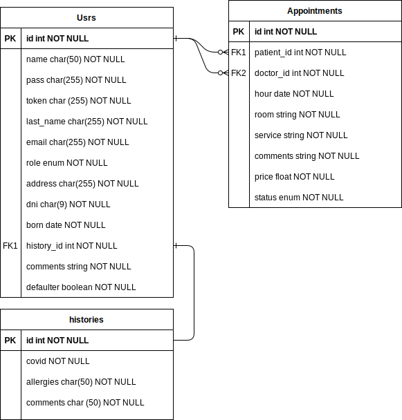

# DENTAL CLINIC APP
Backend of app aimed at management of dental appointments by admins or clients.
## TABLE OF CONTENTS
1. [ SET UP ](#inst) :point_left:
2. [ DATABASE ](#db) :point_left:
3. [ RUN ](#run) :point_left:
4. [ TECHNOLOGIES USED ](#tech) :point_left:
5. [ AUTHOR ](#author) :point_left:

<a name="inst"></a>
## SET UP
### Pre-requisites
    - 1) npm init
    - 2) npm i express
    - 3) npm i sequelize
    - 4) npm i mysql2
    - 5) npm i sequelize-cli
    - 6) sequelize init

### Project set up
    - Option 1: Heroku
    - Option 2: GitHub Pages: https://adrianoosses.github.io/appDentalClinic/.
    - Option 3:  Download the project from this GitHub.

<a name="db"></a>
## DATABASE


<a name="run"></a>
## RUN
### Run server
Execute in terminal:
```
nodemon app.js
```
### Test
App allows an user makes actions. This user can be admin doctor or patient. In some cases, user have to log in before (auth) or being admin. These actions are endpoint, and they are summarized below: 
### Endpoints
| VERB| PATH|DESCRIPTION|AUTH|ISADMIN|
| ----- | ---- | ---- | ---- | ---- |
| GET | /appointment/getAll | Show all appointments on DB |  | x |
| GET | /appointment/getMy | Show an appointments given email | x |  |
| GET | /appointment/getPending | Show all pendings appointments |  | x |
| POST| /appointment/insert | Insert an appointment into DB | | x |
| DELETE | /appointment/delete | Delete an appointment from DB | | x |
| GET | /user/getAll | Show all users on DB |  | x |
| POST | /user/register | Insert an user into DB |  | |
| GET | /user/login | Login of user given email and password, and generate a token |  |  |
| GET | /user/logout | Log out of user given an email |  |  |

See the postman file appClinic.postman_collection.json for examples.

### Examples
You can find examples for test in commands.txt file.

<a name="tech"></a>
## TECHNOLOGIES USED
- JS/ES6
- Node JS
- Express
- API
- MySql
- Workbench
- Postman
- JSON
- JWT

<a name="author"></a>
## AUTHOR
Adriano Osses


